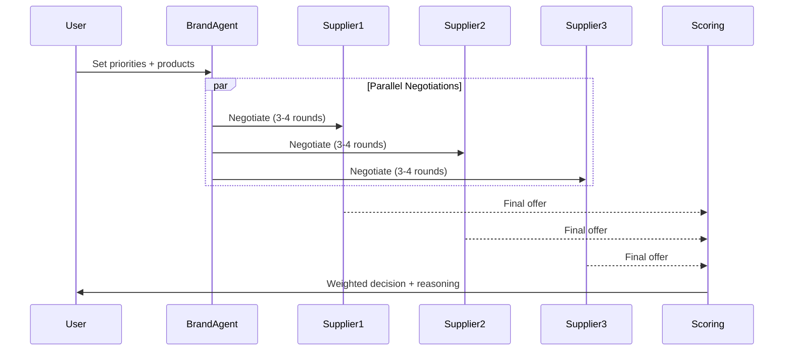

# Quote Agent

AI-driven supplier negotiation platform that automates multi-agent conversations between a brand and suppliers to find the best sourcing deal for footwear products.

## Live Demo

[](https://quote-agent.projects.techlibs.io/quotes/new)
[](https://quote-agent.projects.techlibs.io/quotes/history)

## How It Works

The platform runs **parallel negotiations** with 3 supplier agents simultaneously. Each negotiation consists of 3-4 rounds of back-and-forth offers, after which a weighted scoring engine selects the best supplier.



### Negotiation Flow

1. **User Input**: Select products, quantities, and priority weights (quality, cost, lead time, payment terms)
2. **Brand Agent**: Represents the buyer's interests, negotiates based on user priorities
3. **Supplier Agents**: Each has distinct personality and pricing strategy
4. **Scoring Engine**: Evaluates final offers using weighted scoring
5. **Decision**: AI generates reasoning explaining the supplier selection

## How the Brand Agent Selects the Best Supplier

The brand agent uses a **weighted scoring formula** to rank suppliers:

| Criterion | How It's Scored | Example |
|-----------|-----------------|---------|
| **Quality** | Normalized from 0-5 rating | 4.7/5 → 85/100 |
| **Cost** | Relative pricing (lowest = 100) | Cheapest gets 100, most expensive gets 0 |
| **Lead Time** | Faster = higher score | 15 days → 90/100, 45 days → 30/100 |
| **Payment Terms** | Even splits favored | 33/33/33 → 100, 30/70 → 60 |

**Total Score** = (Quality × weight%) + (Cost × weight%) + (LeadTime × weight%) + (PaymentTerms × weight%)

The user sets priority weights (summing to 100%), which determines how much each factor influences the final decision.

## Supplier Agent Personalities

Each supplier agent has a distinct negotiation strategy:

| Supplier | Strategy | Quality | Lead Time | Payment | Price Flexibility |
|----------|----------|---------|-----------|---------|-------------------|
| **Supplier 1** | Value-focused | 4.0/5 | 45 days | 33/33/33 | Up to 15% |
| **Supplier 2** | Quality-focused | 4.7/5 | 25 days | 30/70 | Up to 12% |
| **Supplier 3** | Speed-focused | 4.0/5 | 15 days | 30/70 | Up to 18% |

**Supplier 1** leads with competitive pricing and volume discounts. Best for cost-conscious buyers.

**Supplier 2** defends premium pricing with quality arguments. Best for high-end products.

**Supplier 3** highlights fast delivery and reliability. Best for urgent restocks.

### Negotiation Tools

All agents use structured tools for negotiation actions:

- `propose-offer` - Submit initial offer with price, lead time, payment terms
- `counter-offer` - Counter previous offer with modified terms
- `accept-offer` - Accept terms and finalize the deal

Suppliers can also suggest **material substitutions** (e.g., synthetic leather instead of premium leather) to reduce costs.

## Project Structure

```
src/
├── mastra/                    # AI agent system
│   ├── agents/
│   │   ├── brand-agent.ts     # Buyer's negotiation agent
│   │   └── supplier-agent.ts  # Supplier agent factory (3 personalities)
│   ├── workflows/
│   │   └── negotiation-workflow.ts  # Orchestrates parallel negotiations
│   └── tools/
│       ├── negotiation-tools.ts     # Propose, counter, accept tools
│       └── scoring-tool.ts          # Weighted scoring engine
├── server/                    # Convex backend
│   ├── schema.ts              # Database schema
│   ├── quotes.ts              # Quote mutations & queries
│   ├── negotiations.ts        # Negotiation state management
│   └── messages.ts            # Real-time message storage
├── features/quotes/           # UI feature module
│   ├── useCases/              # Pages (CreateQuote, Negotiation, History)
│   └── ui/                    # Components (ConversationMessages, etc.)
└── shared/                    # Shared components, hooks, utilities
```

See [AGENTS.md](AGENTS.md) for the complete project structure and task breakdown.

## Quickstart

### Prerequisites

- [Node.js](https://nodejs.org/) 18+ or [Bun](https://bun.sh/)
- [Bun](https://bun.sh/) runtime & package manager
- [Convex account](https://dashboard.convex.dev/) (free tier)
- OpenAI API key

### Setup

```bash
# 1. Install dependencies
bun install

# 2. Configure environment
cp .env.example .env
```

Add your API keys to `.env`:

```env
OPENAI_API_KEY=sk-...
VITE_OPENAI_API_KEY=sk-...
```

### Run Development Servers

The app requires **3 terminals** running simultaneously:

```bash
# Terminal 1: Convex backend
bun run convex:dev

# Terminal 2: Mastra AI server (port 4111)
bun run dev:mastra

# Terminal 3: Vite frontend (port 5173)
bun run dev
```

Open [http://localhost:5173](http://localhost:5173) to start negotiating.

## Tech Stack

| Layer | Technology |
|-------|------------|
| **Frontend** | React 18, TypeScript, Tailwind CSS, shadcn/ui |
| **Backend** | Convex (real-time database & server functions) |
| **AI Framework** | Mastra.ai (multi-agent orchestration) |
| **AI Model** | OpenAI GPT-4o |
| **Validation** | Zod schemas |
| **Routing** | React Router v7 |

## Scripts

```bash
bun run dev           # Start Vite dev server
bun run dev:mastra    # Start Mastra AI server
bun run convex:dev    # Start Convex backend
bun run build         # Production build
bun run test          # Run tests
bun run typecheck     # TypeScript check
bun run lint          # ESLint
```

## Environment Variables

| Variable | Required | Description |
|----------|----------|-------------|
| `OPENAI_API_KEY` | Yes | OpenAI API key (server-side) |
| `VITE_OPENAI_API_KEY` | Yes | OpenAI API key (client-side) |
| `VITE_MASTRA_API_URL` | No | Mastra server URL (default: `http://localhost:4111`) |
| `CONVEX_DEPLOYMENT` | No | Convex deployment URL |

## License

MIT
